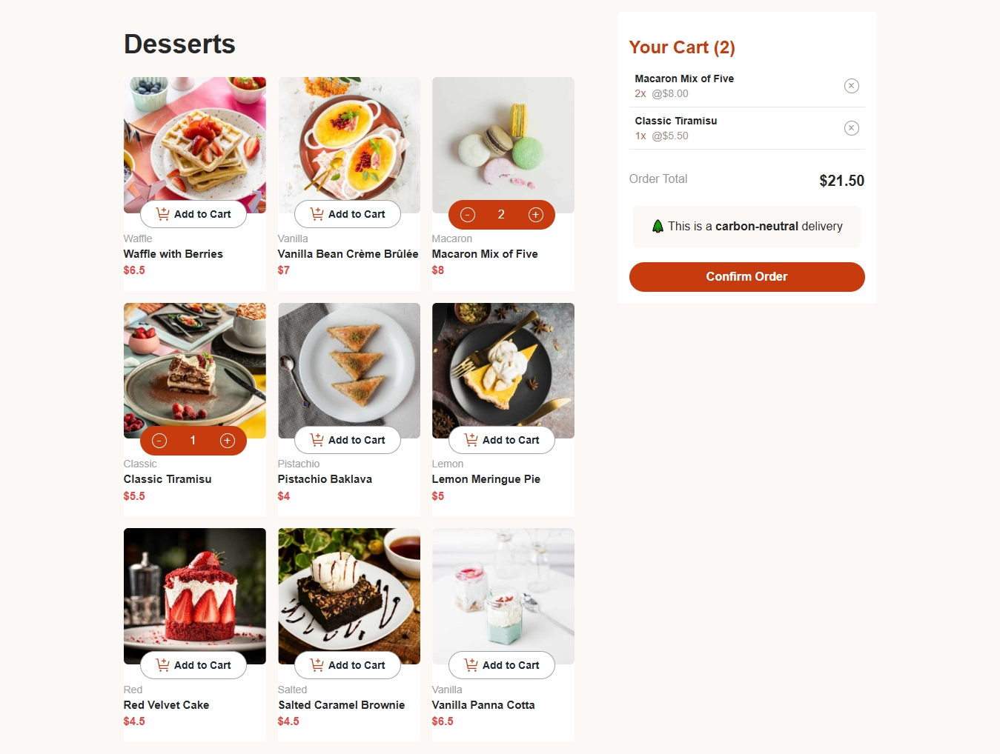

# Frontend Mentor - Product list with cart solution

This is a solution to the [Product list with cart challenge on Frontend Mentor](https://www.frontendmentor.io/challenges/product-list-with-cart-5MmqLVAp_d).

## Table of contents

- [Overview](#overview)
  - [The challenge](#the-challenge)
  - [Screenshot](#screenshot)
  - [Links](#links)
- [My process](#my-process)
  - [Built with](#built-with)
  - [What I learned](#what-i-learned)
  - [Continued development](#continued-development)
- [Author](#author)

## Overview

### The challenge

Users should be able to:

- Add items to the cart and remove them
- Increase/decrease the number of items in the cart
- See an order confirmation modal when they click "Confirm Order"
- Reset their selections when they click "Start New Order"
- View the optimal layout for the interface depending on their device's screen size
- See hover and focus states for all interactive elements on the page

### Screenshot

### Links

- Solution URL: [Github](https://github.com/UmanIjaz/E-Commerce.git)
<!-- - Live Site URL:  -->

## My process

### Built with

- Semantic HTML5 markup
- Flexbox
- CSS Grid
- [React](https://reactjs.org/) - JS library
- [TailwindCss](http://tailwindcss.com/) - Css framework
- [Vite](https://vite.dev/)

### What I learned

Professinal File Strcutre
Working with Vite
Working with tailwindcss and react also

### Continued development

I want to learn more about Css Grid, and mobile first approach of tailwindcss. Responsive desings are also what I have to revise.

## Author

- Name - Muhammad Uman Ijaz
- Linkedin - 
- Frontend Mentor - [@UmanIjaz](https://www.frontendmentor.io/profile/UmanIjaz)
- Github - 
